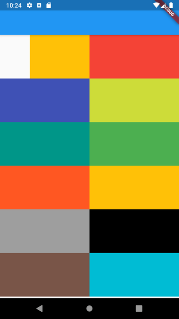
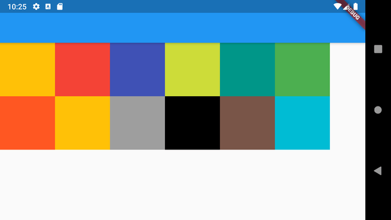

# responsive

[](https://travis-ci.org/flutterchina/dio)
[](https://pub.dartlang.org/packages/responsive)
[](https://github.com/flutter-es/responsive)

Allow to easily build a responsive Flutter UI, made by [Marvin Quevedo](https://www.gcoding.academy/pages/quienes-somos)  and [Víctor Guardiola](mailto:victor.guardiola@gmail.com) of FlutterEs Community.

Este paquete ha sido creado por la comunidad de Flutter en Español, si deseas ser parte de nosotros, puedes visitar cualquiera de estos links:

[Facebook](https://www.facebook.com/groups/flutter.dart.spanish/)

[Slack](https://bit.ly/FlutterDevsEnEspanol)

[Twitter](https://twitter.com/esflutter)

[www.flutter-es.io](https://www.flutter-es.io)

[Telegram](https://t.me/flutter_dart_spanish)






### Add dependency

```yaml
dependencies:
  responsive: 0.2.2
```
## Usage

You have two ways of use it:

You can use the ReponsiveRow widget and the FlexResponsive widget to make the layout

or 

you can use the static method Responsive.calcColumns to assign the correct number of columns to a widget like a GridView. 

## Easy to use

```dart
import 'package:flutter/material.dart';
import 'package:responsive/flex_widget.dart';
import 'package:responsive/responsive_row.dart';

void main() => runApp(MyApp());

class MyApp extends StatelessWidget {
  // This widget is the root of your application.
  @override
  Widget build(BuildContext context) {
    return MaterialApp(
      title: 'Responsive Example',
      theme: ThemeData(
        primarySwatch: Colors.blue,
      ),
      home: Scaffold(
        appBar: AppBar(),
        body: ListView(
          children: <Widget>[
            ResponsiveRow(
              columnsCount: 12,
              crossAxisAlignment: WrapCrossAlignment.center,
              children: <Widget>[
                FlexWidget(
                  child: Container(
                    height: 100,
                    color: Colors.amber,
                  ),
                  xs: 4,
                  xsOffset: 2,
                  sm: 3,
                  md: 2,
                  lg: 1,
                  xsLand: 4,
                  xsLandOffset: 0,
                  smLand: 2,
                  mdLand: 1,
                  lgLand: 1,
                ),
                FlexWidget(
                  child: Container(
                    height: 100,
                    color: Colors.red,
                  ),
                  xs: 6,
                  sm: 3,
                  md: 2,
                  lg: 1,
                  xsLand: 4,
                  smLand: 2,
                  mdLand: 1,
                  lgLand: 1,
                ),
                FlexWidget(
                  child: Container(
                    height: 100,
                    color: Colors.indigo,
                  ),
                  xs: 6,
                  sm: 3,
                  md: 2,
                  lg: 1,
                  xsLand: 4,
                  smLand: 2,
                  mdLand: 1,
                  lgLand: 1,
                ),
                FlexWidget(
                  child: Container(
                    height: 100,
                    color: Colors.lime,
                  ),
                  xs: 6,
                  sm: 3,
                  md: 2,
                  lg: 1,
                  xsLand: 4,
                  smLand: 2,
                  mdLand: 1,
                  lgLand: 1,
                ),
                FlexWidget(
                  child: Container(
                    height: 100,
                    color: Colors.teal,
                  ),
                  xs: 6,
                  sm: 3,
                  md: 2,
                  lg: 1,
                  xsLand: 4,
                  smLand: 2,
                  mdLand: 1,
                  lgLand: 1,
                ),
                FlexWidget(
                  child: Container(
                    height: 100,
                    color: Colors.green,
                  ),
                  xs: 6,
                  sm: 3,
                  md: 2,
                  lg: 1,
                  xsLand: 4,
                  smLand: 2,
                  mdLand: 1,
                  lgLand: 1,
                ),
                FlexWidget(
                  child: Container(
                    height: 100,
                    color: Colors.deepOrange,
                  ),
                  xs: 6,
                  sm: 3,
                  md: 2,
                  lg: 1,
                  xsLand: 4,
                  smLand: 2,
                  mdLand: 1,
                  lgLand: 1,
                ),
                FlexWidget(
                  child: Container(
                    height: 100,
                    color: Colors.amber,
                  ),
                  xs: 6,
                  sm: 3,
                  md: 2,
                  lg: 1,
                  xsLand: 4,
                  smLand: 2,
                  mdLand: 1,
                  lgLand: 1,
                ),
                FlexWidget(
                  child: Container(
                    height: 100,
                    color: Colors.grey,
                  ),
                  xs: 6,
                  sm: 3,
                  md: 2,
                  lg: 1,
                  xsLand: 4,
                  smLand: 2,
                  mdLand: 1,
                  lgLand: 1,
                ),
                FlexWidget(
                  child: Container(
                    height: 100,
                    color: Colors.black,
                  ),
                  xs: 6,
                  sm: 3,
                  md: 2,
                  lg: 1,
                  xsLand: 4,
                  smLand: 2,
                  mdLand: 1,
                  lgLand: 1,
                ),
                FlexWidget(
                  child: Container(
                    height: 100,
                    color: Colors.brown,
                  ),
                  xs: 6,
                  sm: 3,
                  md: 2,
                  lg: 1,
                  xsLand: 4,
                  smLand: 2,
                  mdLand: 1,
                  lgLand: 1,
                ),
                FlexWidget(
                  child: Container(
                    height: 100,
                    color: Colors.cyan,
                  ),
                  xs: 6,
                  sm: 3,
                  md: 2,
                  lg: 1,
                  xsLand: 4,
                  smLand: 2,
                  mdLand: 1,
                  lgLand: 1,
                ),
              ],
            )
          ],
        ),
      ),
    );
  }
}
